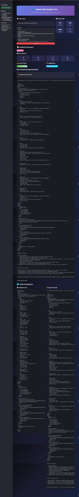

# 🔍 Smart Code Analyzer Pro

A modern, AI-powered Python code analysis tool that provides comprehensive static analysis, intelligent suggestions, and automated code improvements using Google Gemini AI.

  



*Smart Code Analyzer Pro - Modern AI-powered code analysis with comprehensive static analysis, intelligent suggestions, and automated improvements*

## ✨ Features

### 🔍 Advanced Code Analysis
- **Static Code Analysis**: AST-based code structure analysis
- **Syntax Validation**: Real-time syntax error detection
- **Code Metrics**: Function, class, import, and line count analysis
- **Issue Detection**: Automatic detection of common code issues
- **Best Practices**: PEP 8 compliance checking

### 🤖 AI-Powered Improvements
- **Intelligent Suggestions**: AI-generated code improvements
- **Performance Optimization**: Automated performance enhancement suggestions
- **Code Refactoring**: Smart code restructuring recommendations
- **Best Practices**: AI-driven coding standards enforcement

### 📊 Modern Dashboard
- **Real-time Metrics**: Live code statistics
- **Visual Analytics**: Interactive charts and graphs
- **Issue Tracking**: Categorized problem identification
- **Suggestion Management**: Organized improvement recommendations

### 🎨 Beautiful UI/UX
- **Dark Theme**: Modern glassmorphism design
- **Responsive Layout**: Works on all screen sizes
- **Interactive Elements**: Hover effects and animations
- **Real-time Feedback**: Instant analysis results

## 🚀 Quick Start

### Prerequisites
- Python 3.8 or higher
- Google Gemini API key ([Get it here](https://makersuite.google.com/app/apikey))

### Installation

1. **Clone the repository**
   ```bash
   git clone <repository-url>
   cd Automated_code_debugging_Assistant
   ```

2. **Create virtual environment**
   ```bash
   python -m venv venv
   venv\Scripts\activate  # Windows
   source venv/bin/activate  # Linux/Mac
   ```

3. **Install dependencies**
   ```bash
   pip install -r requirements.txt
   ```

4. **Set up environment variables**
   ```bash
   # Create .env file
   echo GEMINI_API_KEY=your_gemini_api_key_here > .env
   ```

5. **Run the application**
   ```bash
   streamlit run main.py
   ```

6. **Open your browser**
   Navigate to `http://localhost:8501`

## 📁 Project Structure

```
Automated_code_debugging_Assistant/
├── main.py                 # Main Streamlit application
├── agents.py              # AI analysis engine
├── analyzer.py            # Static code analysis utilities
├── requirements.txt       # Python dependencies
├── .env                  # Environment variables
├── README.md             # Project documentation
└── .gitignore           # Git ignore file
```

## 🔧 Configuration

### Environment Variables

Create a `.env` file in the root directory:

```env
GEMINI_API_KEY=your_gemini_api_key_here
```

### Getting Your Gemini API Key

1. Visit [Google AI Studio](https://makersuite.google.com/app/apikey)
2. Sign in with your Google account
3. Click "Create API Key"
4. Copy the generated key to your `.env` file

## 🎯 How It Works

### 1. Code Input
- Users paste Python code into the text area
- Real-time statistics are calculated
- Code is validated for syntax errors

### 2. Static Analysis
- AST (Abstract Syntax Tree) parsing
- Code structure analysis
- Issue detection and categorization
- Metrics calculation

### 3. AI Enhancement
- Gemini AI analyzes the code
- Provides intelligent improvements
- Suggests best practices
- Generates optimized code versions

### 4. Results Display
- Comprehensive analysis dashboard
- Issue and suggestion categorization
- Side-by-side code comparison
- Download improved code

## 📊 Analysis Features

### Code Metrics
- **Lines of Code**: Total line count
- **Functions**: Number of function definitions
- **Classes**: Number of class definitions
- **Imports**: Import statement count
- **Characters**: Total character count
- **Words**: Word count analysis

### Issue Detection
- **Print Statements**: Detection of print() usage
- **Bare Except**: Identification of bare except clauses
- **Unused Imports**: Detection of potentially unused imports
- **Line Length**: PEP 8 line length compliance
- **Syntax Errors**: Real-time syntax validation

### AI Improvements
- **Code Optimization**: Performance enhancements
- **Best Practices**: PEP 8 compliance improvements
- **Error Handling**: Better exception handling
- **Documentation**: Improved code documentation
- **Refactoring**: Code structure improvements

## 🎨 UI Features

### Design Elements
- **Glassmorphism**: Modern glass-like UI elements
- **Dark Theme**: Eye-friendly dark color scheme
- **Gradient Backgrounds**: Beautiful gradient effects
- **Interactive Cards**: Hover effects and animations

### User Experience
- **Real-time Feedback**: Instant analysis results
- **Visual Metrics**: Interactive charts and graphs
- **Code Highlighting**: Syntax-highlighted code display
- **Download Options**: Export improved code

## 🔍 Troubleshooting

### Common Issues

1. **API Key Error**
   ```
   ❌ API Key Error
   ```
   **Solution**: Ensure your `.env` file contains a valid `GEMINI_API_KEY`

2. **Import Error**
   ```
   ImportError: cannot import name 'CodeInterpreterTool'
   ```
   **Solution**: This has been resolved in the new version - no more CrewAI dependencies

3. **Analysis Failed**
   ```
   ❌ Analysis failed
   ```
   **Solution**: Check internet connection and API key validity

### Performance Tips
- Use clear, well-formatted code for better analysis
- Ensure proper indentation in your Python code
- Avoid extremely large code files (>1000 lines)
- Check your API key quota and limits

## 🛠️ Technical Details

### Technologies Used
- **Frontend**: Streamlit with custom CSS
- **AI Processing**: Google Gemini 1.5 Flash
- **Code Analysis**: Python AST (Abstract Syntax Tree)
- **Visualization**: Plotly, Pandas
- **Styling**: Custom CSS with glassmorphism

### Key Components

#### `agents.py`
- Contains the `CodeAnalysisEngine` class
- Implements AST-based code analysis
- Handles Gemini AI integration
- Manages code improvement generation

#### `main.py`
- Streamlit application interface
- Modern UI implementation
- Results visualization and display
- Download functionality

#### `analyzer.py`
- Static code analysis utilities
- AST parsing and validation
- Issue detection algorithms

## 📈 Advanced Features

### Code Analysis Engine
The system uses advanced AST parsing to:

1. **Parse Code Structure**: Analyze code hierarchy and relationships
2. **Detect Issues**: Identify common coding problems
3. **Calculate Metrics**: Provide comprehensive code statistics
4. **Generate Insights**: Create actionable improvement suggestions

### AI Enhancement
- **Context-Aware Analysis**: Understands code context and purpose
- **Best Practice Suggestions**: Recommends coding standards compliance
- **Performance Optimization**: Suggests efficiency improvements
- **Error Prevention**: Identifies potential runtime issues

### Export Capabilities
- **Download Improved Code**: Save enhanced code versions
- **Analysis Reports**: Export detailed analysis results
- **Metrics Export**: Save code statistics and metrics

## 🎯 Use Cases

### For Developers
- **Code Review**: Automated code quality assessment
- **Learning Tool**: Understand best practices
- **Refactoring**: Get suggestions for code improvement
- **Debugging**: Identify potential issues before runtime

### For Teams
- **Code Standards**: Enforce consistent coding practices
- **Quality Assurance**: Automated code quality checks
- **Documentation**: Generate code documentation
- **Training**: Onboard new team members

### For Students
- **Learning Python**: Understand coding best practices
- **Assignment Help**: Get suggestions for code improvement
- **Debugging Practice**: Learn to identify and fix issues
- **Code Optimization**: Understand performance considerations

---

*Transform your Python development with AI-powered code analysis and intelligent improvements!* 