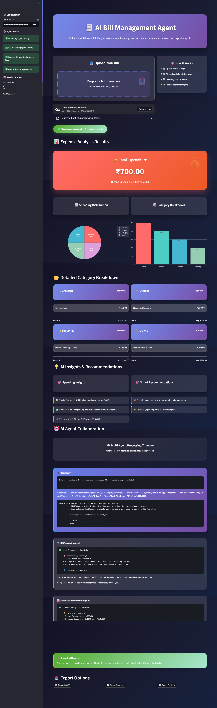
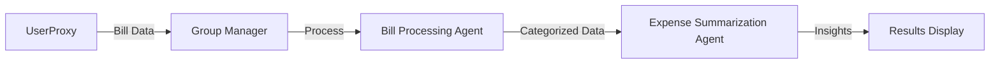

# 🧾 AI Bill Management Agent

A sophisticated multi-agent system that processes bill images, categorizes expenses, and provides intelligent spending insights using Google Gemini AI and AutoGen framework.

  


## ✨ Features

### 🤖 Multi-Agent Collaboration
- **UserProxy Agent**: Initiates conversations and manages user interactions
- **Bill Processing Agent**: Extracts and categorizes expenses from bill images
- **Expense Summarization Agent**: Analyzes spending patterns and generates insights
- **Group Chat Manager**: Coordinates agent collaboration

### 📊 Advanced Analytics
- Real-time expense categorization (Groceries, Dining, Utilities, Shopping, Entertainment, Others)
- Interactive charts and visualizations
- Spending distribution analysis
- Smart recommendations and insights
- Export capabilities (CSV, JSON, Summary reports)

### 🎨 Modern UI/UX
- Dark theme with glassmorphism design
- Responsive layout with interactive elements
- Real-time processing feedback
- Agent collaboration timeline visualization
- Mobile-friendly interface

## 🚀 Quick Start

### Prerequisites
- Python 3.8 or higher
- Google Gemini API key ([Get it here](https://makersuite.google.com/app/apikey))

### Installation

1. **Clone the repository**
   ```bash
   git clone <repository-url>
   cd bill-management-agent
   ```

2. **Install dependencies**
   ```bash
   pip install -r requirements.txt
   ```

3. **Set up environment variables**
   ```bash
   # Copy the example environment file
   cp .env.example .env
   
   # Edit .env and add your Gemini API key
   nano .env
   ```

4. **Run the application**
   ```bash
   streamlit run main.py
   ```

5. **Open your browser**
   Navigate to `http://localhost:8501`

## 📁 Project Structure

```
bill-management-agent/
├── main.py                 # Main Streamlit application
├── agents.py              # Multi-agent system implementation
├── requirements.txt       # Python dependencies
├── .env.example          # Environment variables template
├── README.md             # Project documentation
└── .gitignore           # Git ignore file
```

## 🔧 Configuration

### Environment Variables

Create a `.env` file in the root directory:

```env
GEMINI_API_KEY=your_gemini_api_key_here
```

### Getting Your Gemini API Key

1. Visit [Google AI Studio](https://makersuite.google.com/app/apikey)
2. Sign in with your Google account
3. Click "Create API Key"
4. Copy the generated key to your `.env` file

## 🎯 How It Works

### 1. Upload Process
- Users upload bill images (JPG, JPEG, PNG)
- Image is processed through Gemini Vision AI
- Expenses are extracted and structured

### 2. Agent Collaboration


### 3. Analysis & Insights
- Automatic categorization into 6 main categories
- Spending pattern analysis
- Budget recommendations
- Export capabilities

## 📊 Supported Categories

| Category | Icon | Examples |
|----------|------|----------|
| Groceries | 🛒 | Food items, household supplies |
| Dining | 🍽️ | Restaurants, takeout, cafes |
| Utilities | ⚡ | Electricity, water, internet |
| Shopping | 🛍️ | Clothing, electronics, misc items |
| Entertainment | 🎬 | Movies, games, subscriptions |
| Others | 📦 | Miscellaneous expenses |

## 🛠️ Technical Details

### Technologies Used
- **Frontend**: Streamlit with custom CSS
- **AI Processing**: Google Gemini 1.5 Flash
- **Multi-Agent Framework**: Microsoft AutoGen
- **Visualization**: Plotly, Pandas
- **Image Processing**: PIL (Pillow)

### Key Components

#### `agents.py`
- Contains the `BillManagementAgents` class
- Implements all agent logic and coordination
- Handles Gemini AI integration
- Manages expense data processing

#### `main.py`
- Streamlit application interface
- Modern UI implementation
- Results visualization and display
- Export functionality

## 📈 Features in Detail

### Multi-Agent System
The system uses four specialized agents:

1. **UserProxy Agent**
   - Initiates conversations
   - Manages user inputs
   - Coordinates with group manager

2. **Bill Processing Agent**
   - Extracts expense data from images
   - Categorizes items accurately
   - Validates and cleans data

3. **Expense Summarization Agent**
   - Analyzes spending patterns
   - Generates insights and recommendations
   - Calculates category-wise totals

4. **Group Chat Manager**
   - Coordinates agent interactions
   - Manages conversation flow
   - Ensures proper task completion

### Advanced Analytics
- **Spending Distribution**: Interactive pie charts
- **Category Comparison**: Bar charts with trend analysis
- **Smart Insights**: AI-powered recommendations
- **Budget Alerts**: Automatic spending pattern detection

### Export Options
- **CSV Export**: Detailed expense data
- **Summary Report**: Text-based summary
- **JSON Analysis**: Complete data with metadata

## 🎨 UI/UX Features

### Design Elements
- **Glassmorphism**: Modern glass-like UI elements
- **Dark Theme**: Eye-friendly dark color scheme
- **Responsive Design**: Works on all screen sizes
- **Interactive Elements**: Hover effects and animations

### User Experience
- **Real-time Feedback**: Processing status updates
- **Visual Insights**: Charts and graphs
- **Agent Timeline**: Collaboration visualization
- **Easy Export**: One-click data export

## 🔍 Troubleshooting

### Common Issues

1. **API Key Error**
   ```
   Error: Please enter your Gemini API key to continue
   ```
   **Solution**: Ensure your `.env` file contains a valid `GEMINI_API_KEY`

2. **Image Processing Failed**
   ```
   Failed to extract expenses from the image
   ```
   **Solution**: Try with a clearer, higher-resolution image

3. **Agent Collaboration Error**
   ```
   Error in agent collaboration
   ```
   **Solution**: Check internet connection and API key validity

### Performance Tips
- Use high-quality, well-lit bill images
- Ensure text is clearly visible in the image
- Avoid blurry or rotated images
- Images should be under 10MB


*Transform your expense tracking with AI-powered multi-agent collaboration!*