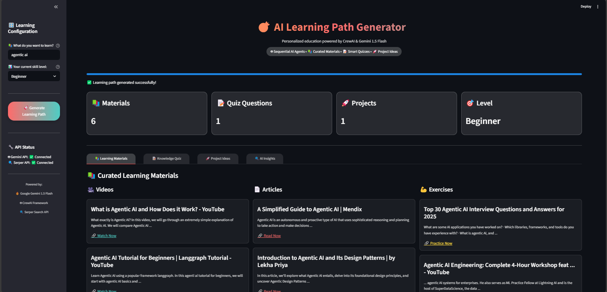

# 🎯 AI Learning Path Generator

A sophisticated **CrewAI-powered** system that generates personalized educational recommendations using **Google Gemini 1.5 Flash**. This application creates comprehensive learning paths with curated materials, interactive quizzes, and hands-on project ideas tailored to your expertise level.

## ✨ Features

- 🤖 **Sequential AI Agents**: Three specialized CrewAI agents working in coordination
- 📚 **Smart Content Curation**: Web-powered learning material discovery
- 📝 **Intelligent Quiz Generation**: AI-created assessment questions with explanations
- 🚀 **Project-Based Learning**: Hands-on project ideas matched to skill level
- 🎨 **Modern UI**: Beautiful Streamlit interface with gradient themes
- 📊 **Visual Analytics**: Interactive charts showing content generation metrics
- 🔍 **Real-time Search**: Live web search integration via Serper API

## 🏗️ Architecture

### CrewAI Agents
1. **Learning Material Curator** - Finds and curates educational resources
2. **Quiz Creator Specialist** - Generates assessment questions with explanations  
3. **Project Mentor** - Designs practical project ideas by skill level

### Technology Stack
- **AI Framework**: CrewAI with sequential processing
- **LLM**: Google Gemini 1.5 Flash
- **Web Interface**: Streamlit with custom CSS
- **Search API**: Serper for real-time web results
- **Data Validation**: Pydantic models for structured outputs
- **Visualization**: Plotly for interactive charts

## 🚀 Quick Start

### For Google Colab

1. **Upload the colab_setup.py file and run:**
```python
exec(open('colab_setup.py').read())
full_setup()
```

2. **Upload your app.py file**

3. **Run the Streamlit app:**
```bash
!streamlit run app.py --server.port 8501
```

### For Local Development

1. **Clone and install dependencies:**
```bash
git clone <repository-url>
cd ai-learning-path-generator
pip install -r requirements.txt
```

2. **Set up environment variables:**
```bash
cp .env.template .env
# Edit .env with your API keys
```

3. **Run the application:**
```bash
streamlit run app.py
```

## 🔑 API Keys Required

### Google Gemini API Key (Required)
- **Purpose**: Powers the AI agents and content generation
- **Get it from**: [Google AI Studio](https://makersuite.google.com/app/apikey)
- **Free tier**: Available with generous limits

### Serper API Key (Required for full functionality)  
- **Purpose**: Enables web search for learning materials
- **Get it from**: [Serper.dev](https://serper.dev/)
- **Free tier**: 2,500 searches per month

## 📝 Environment Setup

Create a `.env` file with your API keys:

```env
# Google Gemini API Key (Required)
GEMINI_API_KEY=your_gemini_api_key_here

# Serper API Key (Required for web search)
SERPER_API_KEY=your_serper_api_key_here

# Optional: Set logging level
LOG_LEVEL=INFO
```

## 🎮 How to Use

1. **Launch the application**
2. **Enter your learning topic** (e.g., "Machine Learning", "Python", "Data Science")
3. **Select your skill level** (Beginner, Intermediate, Advanced)
4. **Click "Generate Learning Path"**
5. **Explore the results** across four tabs:
   - 📚 **Learning Materials**: Curated videos, articles, and exercises
   - 📝 **Knowledge Quiz**: AI-generated questions with explanations
   - 🚀 **Project Ideas**: Hands-on projects matched to your level
   - 🔍 **AI Insights**: Generation analytics and agent execution details

## 🏆 Key Components

### Structured Data Models
```python
class LearningPath(BaseModel):
    topic: str
    materials: List[LearningMaterial]
    quiz: List[QuizQuestion] 
    projects: List[ProjectIdea]
```

### Custom CrewAI Tool
```python
class ProjectSuggestionTool(BaseTool):
    """Generates tailored project ideas by expertise level"""
```

### Sequential Process Flow
1. **Material Curation**: Agent searches and curates learning resources
2. **Quiz Generation**: Agent creates assessment questions
3. **Project Design**: Agent suggests practical projects
4. **Structured Output**: Results formatted using Pydantic models

## 🎨 UI Features

- **Gradient Background**: Modern purple-blue gradient theme
- **Interactive Cards**: Hover effects and smooth transitions
- **Progress Tracking**: Real-time generation progress
- **Responsive Design**: Works on desktop and mobile
- **Dark Theme**: Easy on the eyes for extended learning sessions
- **Visual Analytics**: Plotly charts showing content metrics

## 📊 Sample Output

For a topic like "Machine Learning" at Intermediate level:

- **📚 6-9 Learning Materials**: Mix of videos, articles, and exercises
- **📝 3 Quiz Questions**: With multiple choice and explanations
- **🚀 3 Project Ideas**: Practical ML projects with time estimates
- **📈 Visual Analytics**: Charts showing content distribution

## 🛠️ Customization

### Adding New Agents
```python
custom_agent = Agent(
    role="Your Custom Role",
    goal="Your specific goal", 
    backstory="Agent background",
    llm=gemini_llm,
    tools=[YourCustomTool()]
)
```

### Custom Tools
```python
class YourCustomTool(BaseTool):
    name: str = "Tool Name"
    description: str = "Tool description"
    
    def _run(self, query: str) -> str:
        # Your tool logic here
        return result
```

## 🔧 Troubleshooting

### Common Issues

1. **API Key Errors**
   - Verify keys are set in environment variables
   - Check key validity and quotas

2. **Streamlit Errors in Colab**
   - Use `!streamlit run app.py --server.port 8501`
   - Install pyngrok for tunneling if needed

3. **CrewAI Import Errors**
   - Ensure all langchain dependencies are installed
   - Use the exact versions in requirements.txt

4. **Search Functionality Limited**
   - Serper API key required for web search
   - App will work with limited functionality without it

## 📈 Performance Tips

- **Caching**: Results are processed in real-time (no persistent storage)
- **Rate Limits**: Respects API rate limits automatically
- **Error Handling**: Graceful fallbacks for API failures
- **Resource Usage**: Optimized for efficiency

## 🤝 Contributing

1. Fork the repository
2. Create a feature branch
3. Make your changes
4. Test thoroughly
5. Submit a pull request

## 📄 License

This project is licensed under the MIT License - see the LICENSE file for details.

## 🙏 Acknowledgments

- **CrewAI**: For the amazing AI agent framework
- **Google**: For Gemini 1.5 Flash API
- **Serper**: For web search capabilities
- **Streamlit**: For the beautiful web interface
- **Community**: For feedback and contributions

## 📞 Support

- 🐛 **Bug Reports**: Open an issue on GitHub
- 💡 **Feature Requests**: Discuss in GitHub Discussions  
- 📧 **Contact**: Reach out for collaboration

---

**Built with ❤️ using CrewAI, Gemini 1.5 Flash, and Streamlit**

*Empowering personalized learning through AI-powered agent collaboration*